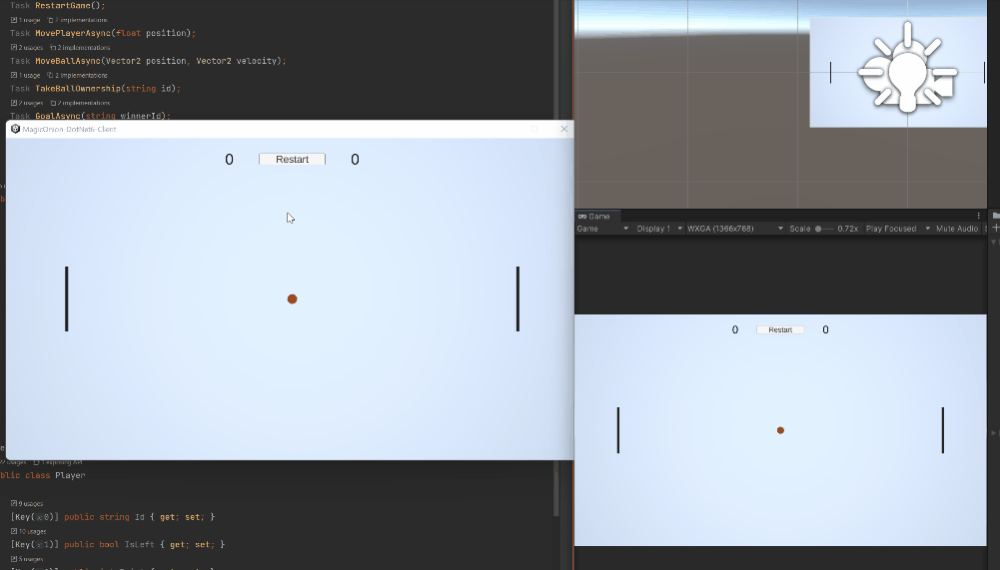

# About

Implementation of multiplayer Pong using MagicOnion, ASP.NET Core 6, Unity2021.2.

# Dependencies that requires manual installation
## MagicOnion-DotNet6-Client
- [MessagePack.Unity.2.2.85](https://github.com/neuecc/MessagePack-CSharp/releases/tag/v2.2.85)
- [grpc_unity_package.2.44.0-dev202112241007](https://packages.grpc.io/)
- [UniRx 7.1.0](https://assetstore.unity.com/packages/tools/integration/unirx-reactive-extensions-for-unity-17276?locale=ja-JP)
- TextMesh Pro